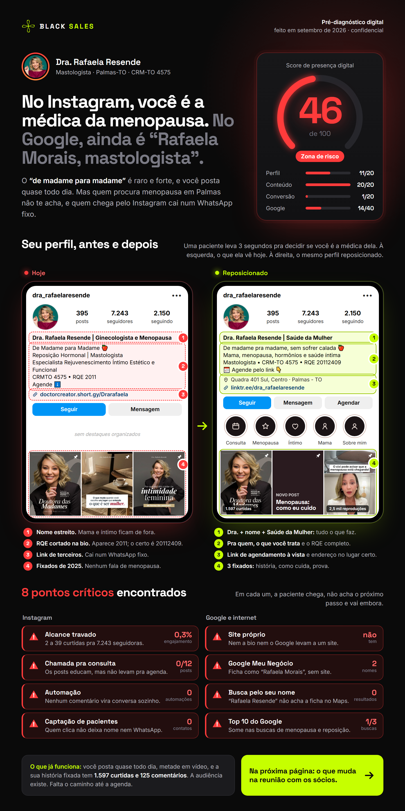
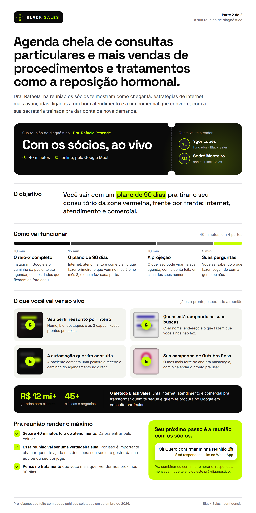

# relatorio-pocket

Skill (Claude Code) da **Black Sales** que transforma o @ do Instagram de um médico prospect em um **pré-diagnóstico de 2 páginas** (PDF + 2 imagens) pro SDR mandar no WhatsApp.

- **Página 1 · O raio-x:** score de presença digital de 0 a 100 (sempre em vermelho), **antes e depois do perfil** do Instagram (skill `ig-profile`) e de 6 a 10 **pontos críticos** com número: consistência, formato, automação, captação de leads, site, Google Meu Negócio, avaliações e top 10 do Google.
- **Página 2 · A reunião:** vende a reunião com os sócios. Mostra o objetivo, como funciona, o que o médico vai ver ao vivo e como se preparar ("vai ser uma verdadeira aula, traga quem decide com você").

| Página 1 | Página 2 |
|---|---|
|  |  |

Exemplo real: Dra. Rafaela Resende, mastologista em Palmas-TO, set/2026 (`exemplo/`).

## Instalação

```bash
git clone https://github.com/ygorlopesproctor/relatorio-pocket-skill.git ~/.claude/skills/relatorio-pocket
```

**Dependências**
1. **Skills `ig-profile` e `ig-human`** (pacote Instagram do Jake Schincariol, MIT): instale em `~/.claude/skills/` a partir de `github.com/Jakeschincariol/instagram-agent-skill`. No Windows, troque `python3` por `python -X utf8` nos SKILL.md.
2. **Python 3 + Pillow** (`pip install pillow`).
3. **Google Chrome ou Microsoft Edge** (o render usa o modo headless).
4. **Token do Apify** na variável de ambiente `APIFY_TOKEN`. Peça ao Ygor e nunca coloque o token em arquivo.

## Uso

No Claude Code, dentro da pasta de trabalho da Black Sales:

```
relatório pocket para @handle_do_medico
```

A skill coleta Instagram e Google, roda a `ig-profile`, calcula o score, monta o HTML e gera:

```
clientes/Prospecções/<slug>/pre-call/relatorio-pocket.pdf
clientes/Prospecções/<slug>/pre-call/pocket-pagina-1.png
clientes/Prospecções/<slug>/pre-call/pocket-pagina-2.png
```

Mande o PDF (ou as 2 imagens) com a mensagem pronta que a skill devolve.

## Estrutura

```
SKILL.md                         # o passo a passo (6 fases)
assets/modelo-relatorio-pocket.html   # o molde: 2 folhas fixas 900×1800, instruções "IA:" em comentário
references/
  coleta-instagram.md            # Apify perfil + posts, grid, destaques
  coleta-google.md               # Apify Google Places, GMB, site, top 10
  score-presenca.md              # rubrica do score 0–100
scripts/render.py                # PDF de 2 págs + PNGs + checagem automática (estouro, placeholder, regras do perfil, promessa)
exemplo/                         # caso pronto (PDF, PNGs, ig-profile.md, score.json)
```

## Regras que não mudam

- 2 páginas fixas. Estourou? Corte texto.
- Score pela rubrica: a cor é sempre vermelha, o número é o real.
- **Nome do perfil reposicionado:** `Dr.`/`Dra.` + nome + `|` + posicionamento amplo, que cubra tudo o que o médico faz. Sem cidade: a localização vai no campo Endereço (linha 📍). O campo Nome aceita 64 caracteres, não 30.
- **Link explícito:** o celular mostra o endereço do link (agendamento online ou Linktree), e a bio chama pra ele.
- **Página 2 com a promessa fixa:** agenda cheia de consultas particulares e mais vendas de procedimentos e tratamentos, com internet, atendimento e comercial, e a secretária treinada.
- Nada de nome de concorrente, data ou hora da reunião, dia do diagnóstico (só mês e ano) ou case de cliente.
- Tudo com dado coletado no dia. Sem dado, sem afirmação.
- Antes de entregar: checagem automática do `render.py` + double check de 12 itens (Fase 7).

## Histórico

- **v2.2 (05/10/2026):** regras do perfil médico (título, posicionamento amplo, endereço, link explícito), mapa de atuação, promessa fixa na página 2, checagem de conteúdo no `render.py` e double check obrigatório. Corrige relatórios que tiravam o "Dra.", punham a cidade no nome e reduziam o médico a uma área só.
- **v2.1 (28/09/2026):** formato de 2 páginas.

---
Material proprietário Black Sales / MadScale. Uso interno da equipe.
